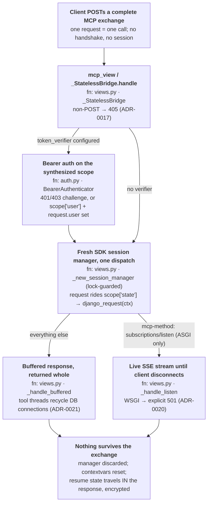

# Architecture

This document is the contributor's map of how django-stateless-mcp works and why it is shaped the way it is.
It is a **living** document: a PR that changes the shape described here updates it in the same PR.
The *decisions* behind the shape are frozen in `docs/adr/` — this document links to them rather than repeating them.
User-facing documentation lives at [django-stateless-mcp.readthedocs.io](https://django-stateless-mcp.readthedocs.io/).

## The mental model

The package is a bridge, and deliberately nothing more.
`mcp_view(server)` returns an async Django view that synthesizes an ASGI scope from the `HttpRequest`, runs it through the MCP SDK's own streamable-HTTP handler with a **fresh session manager per request**, and reassembles the SDK's ASGI messages into a Django response.

Under ASGI the view runs natively; under WSGI, Django starts an event loop per request.
Both facts point at the same design: nothing — no task group, no manager, no loop — may span two requests, and that constraint *is* the product.

## The layer boundary

The `mcp` SDK owns the protocol: types, tool/resource/prompt registration, elicitation and its resume crypto, dispatch, error shaping.
This package owns only the Django layer: the view bridge, auth enforcement in the view, the request context, autodiscovery, and Django-flavoured middleware.

Two rules keep that boundary honest:

- **Never reach into SDK privates.**
  The predecessor package touched SDK internals in 12 places and died when `_mcp_server` and `_event_store` moved.
  If something is only reachable through a `_`-prefixed attribute, that is a design question to raise (here or upstream), never a workaround to write.
- **Never hand-build or regex-parse protocol JSON.**
  Protocol shapes come from SDK types, so the SDK absorbs wire-format drift.

## The three invariants

Everything else in the codebase is style; these are correctness.
Each has a named enforcement point — if you weaken one, a specific test fails.

### 1. Statelessness

No mutable state at module or instance level outlives a request.
State either derives from the request or travels in the payload: the elicitation `requestState` is encrypted and echoed back by the client, keyed from `SECRET_KEY` (plus `SECRET_KEY_FALLBACKS`) via `request_state_security()`, so **any** worker — including one that did not exist when the flow began — can decrypt and resume it ([ADR-0012](docs/adr/0012-request-state-security.md)).

Enforced by the flagship tests: elicitation completing across two independent requests, the retry served by a *different* `MCPServer` instance, and the guard that no response ever carries an `Mcp-Session-Id` header.
The out-of-process harness ([ADR-0019](docs/adr/0019-multiworker-harness.md)) proves it against real uvicorn and gunicorn fleets, including a kill-the-fleet-mid-elicitation resume.

### 2. The public API is deliberate

Five symbols in `__all__` — `mcp_view`, `django_request`, `request_state_security`, `PermittedToolsFilter`, `StructlogRequestLogger` — plus the `INSTALLED_APPS` autodiscovery convention.
Everything else is `_`-prefixed.
`py.typed` ships, so annotations are published contract: no `Any` in public signatures, and downstream code type-checks against us.
If a downstream package would need our privates to do something reasonable, that is a defect in our API, not their problem.

### 3. WSGI/ASGI duality

The same view must serve both deployments; a change that only makes sense under one is wrong.
The one sanctioned asymmetry is `subscriptions/listen`: a live stream needs a server that can hold one, so ASGI streams it and WSGI answers an explicit `501` rather than pinning a worker ([ADR-0020](docs/adr/0020-subscription-streams.md)).

## Module map

| Module | Owns | Key decision |
|---|---|---|
| `views.py` | `_StatelessBridge`: scope synthesis, per-request session manager (lock-guarded — `streamable_http_app()` mutates shared server state), buffered vs. listen-stream dispatch, POST-only, CSRF exemption | [ADR-0007](docs/adr/0007-stateless-view-bridge.md), [0017](docs/adr/0017-post-only-view.md), [0018](docs/adr/0018-example-auth-middleware.md), [0020](docs/adr/0020-subscription-streams.md) |
| `auth.py` | `BearerAuthenticator`: wraps the SDK's `BearerAuthBackend`, enforces in the view (the SDK enforces in a Starlette app the bridge discards), reproduces the SDK's scope contract, resolves the Django user (failing closed to `AnonymousUser`) | [ADR-0011](docs/adr/0011-bearer-auth.md), [0014](docs/adr/0014-user-and-tool-permissions.md) |
| `context.py` | `django_request(ctx)`: the `HttpRequest` rides `scope["state"]` — the transport carries it, so WSGI and ASGI behave identically and no thread-local exists | [ADR-0010](docs/adr/0010-request-context.md) |
| `security.py` | `request_state_security()`: SDK resume-crypto keys derived from Django settings, rotation via `SECRET_KEY_FALLBACKS` | [ADR-0012](docs/adr/0012-request-state-security.md) |
| `permissions.py` | `PermittedToolsFilter`: SDK middleware hiding tools from `tools/list` per user | [ADR-0014](docs/adr/0014-user-and-tool-permissions.md) |
| `logging.py` | `StructlogRequestLogger`: one structured event per request; lazily imported so structlog stays optional | [ADR-0013](docs/adr/0013-observability-middleware.md), [0016](docs/adr/0016-lazy-optional-structlog-import.md) |
| `apps.py` | Autodiscovery: `AppConfig.ready()` imports each installed app's `mcp.py`, like `admin.py`; import failures raise at startup | [ADR-0009](docs/adr/0009-mcp-autodiscovery.md) |
| `example/` | A real launchable project the test suite inherits — demo and fixture cannot drift | [ADR-0015](docs/adr/0015-runnable-example-project.md) |

## Traps

Each of these was a real bug or a deliberately non-obvious call; the code carries the fix, this list carries the pattern.

- **The async/sync boundary.**
  The SDK handler is async; Django tool functions are typically sync and the SDK threads them via `anyio.to_thread`.
  All ORM access happens on the sync side; nothing blocking may run on the event loop.
- **Worker-thread DB connections.**
  Django's `request_finished` cleanup never reaches the SDK's tool threads, so the view runs `close_old_connections` inside that pool after every request — shielded, so a cancelled request still cleans up ([ADR-0021](docs/adr/0021-worker-thread-connection-hygiene.md)).
- **Contextvars are request-spanning state.**
  The SDK's auth contextvar is set-and-reset around each dispatch (`access_token_context`); the leak this guards against passed tests in isolation and failed only as a suite.
- **Hiding is not gating.**
  `PermittedToolsFilter` is least-knowledge ergonomics; a client can still call a hidden tool by name.
  The security boundary is the tool gating its own execution, and a test encodes exactly this ([ADR-0014](docs/adr/0014-user-and-tool-permissions.md)).
- **The synthesized `receive` must be honest.**
  Delivering the body more than once spins SSE disconnect-listeners forever — one anonymous GET pegged a worker at 100% CPU before [ADR-0017](docs/adr/0017-post-only-view.md).
  Buffered dispatch answers body-then-disconnect; the listen stream parks instead, because its end-of-stream signal is cancellation.
- **CSRF exemption is deliberate.**
  `CsrfViewMiddleware` would 403 every MCP POST in a default project; bearer-authenticated APIs are exempt, DRF-style ([ADR-0018](docs/adr/0018-example-auth-middleware.md)).
- **No Django models at module top level** in package code — it crashes the django-stubs mypy plugin with `AppRegistryNotReady`; import lazily or under `TYPE_CHECKING`.
- **Errors raise.**
  No swallowing, no error-shaped return values; the SDK's protocol error handling and Sentry own failures.

## Verifying a change

Each layer proves something the others cannot:

- `uv run pytest` — the suite, through Django's test client only; anything needing a hand-started server is not a test here.
- `uvx --with tox-uv tox run -f py313` — the released matrix (Django 5.2 / 6.0 / 6.1, `PYTHONDEVMODE`, deprecations as errors).
- `just conformance` — the protocol's own conformance suite against a live bootable server ([ADR-0008](docs/adr/0008-conformance-suite.md)).
- `just multiworker` — the out-of-process fleet proof CI alone cannot give ([ADR-0019](docs/adr/0019-multiworker-harness.md)).
- Advisory lanes: per-PR against the SDK's git main ([ADR-0006](docs/adr/0006-test-matrix.md)), weekly against Django's git main ([ADR-0024](docs/adr/0024-weekly-django-main-ci.md)).
- `just qa` — ruff, mypy `--strict` (the gate — [ADR-0001](docs/adr/0001-mypy-strict-over-ty.md)), tests.

## How it should evolve

Protocol work belongs upstream in the SDK; if the bridge needs an SDK capability that only exists privately, file the upstream issue rather than reaching in.
Opinionated features — model exposure, form handling, admin integration — belong in downstream packages built on the public seams; this package stays the thin, boring layer they depend on.
When a change embodies a real decision, it lands with an ADR in `docs/adr/` in the same PR, chained to the ADRs it builds on — that chain is the memory this document links into.
